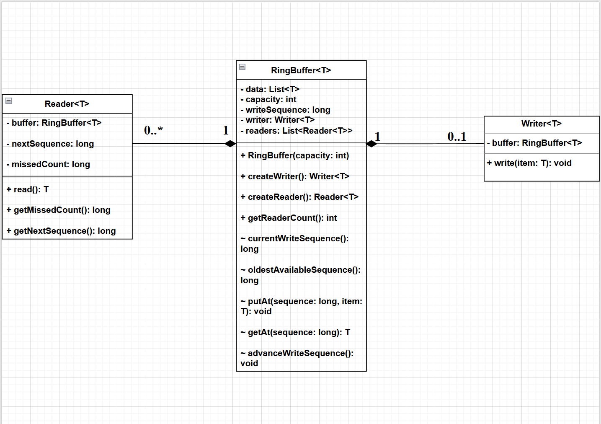
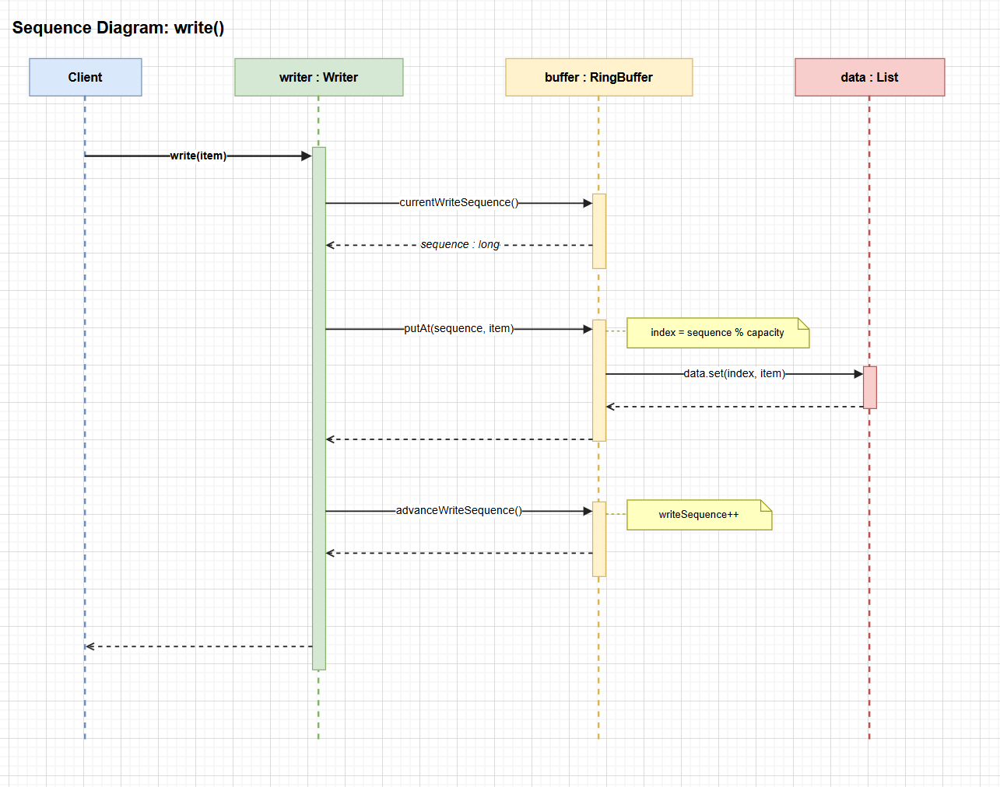
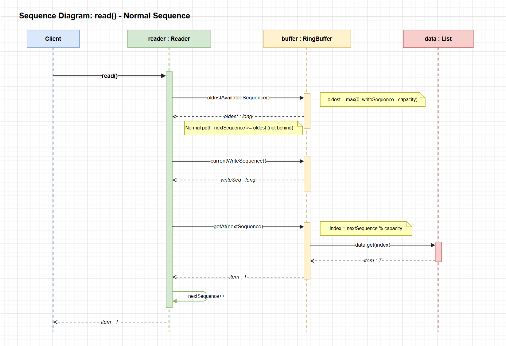
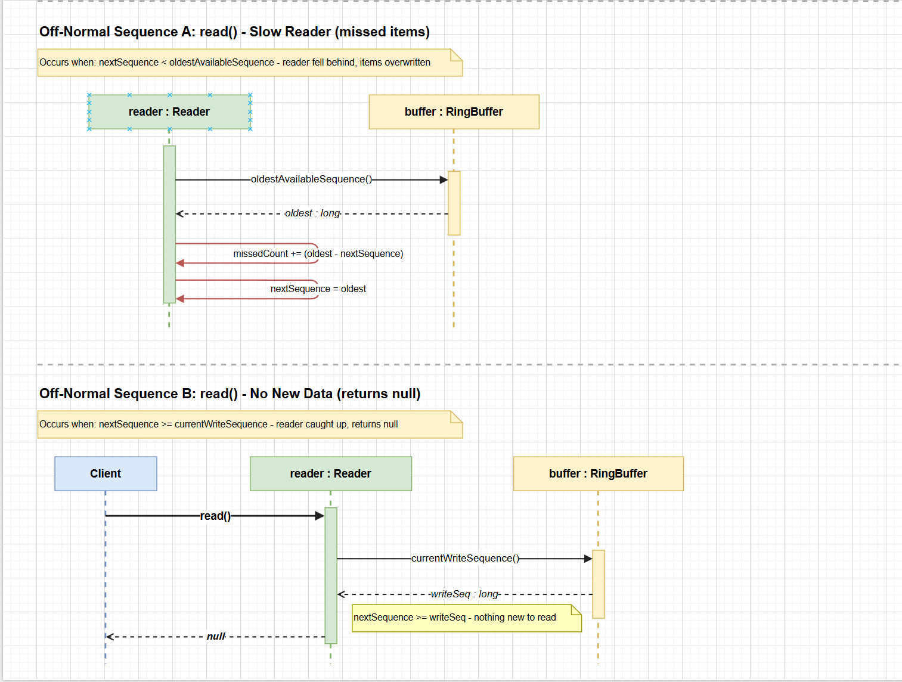

# Ring Buffer

## Project Overview

This project implements a fixed-size Ring Buffer that supports:

- One writer
- Multiple readers
- Independent reader positions
- Overwriting the oldest data when the buffer is full

The buffer has a fixed capacity N. When the buffer becomes full, new writes overwrite the oldest elements. If a reader is too slow, it may miss some items. 

---

## Design Explanation

The system follows clear object-oriented principles. Each class has a specific and well-defined responsibility.

### `RingBuffer<T>`

The `RingBuffer` is responsible for:

- Managing shared storage
- Enforcing the single-writer rule
- Creating reader instances
- Tracking the global write position
- Providing controlled internal access for read/write operations

The buffer stores elements in a fixed-size list. It uses a continuously increasing `writeSequence` to track how many items have been written.

The position in the buffer is calculated using:

```
index = sequence % capacity;
```

This allows the structure to wrap around and overwrite old values when necessary.

The buffer allows only one `Writer` instance. If a second writer is requested, an exception is thrown.

---

### `Writer<T>`

The `Writer` is responsible only for writing data into the buffer.

It does not manage storage directly. Instead, it delegates storage operations to the `RingBuffer`.

For each write operation:

1. It reads the current write sequence.
2. Stores the item at the correct calculated index.
3. Advances the write sequence.

This guarantees centralized and controlled write management.

---

### `Reader<T>`

Each `Reader` maintains its own independent reading position using `nextSequence`.

Key characteristics:

- Readers do not affect each other.
- Reading does not remove data from the buffer.
- Each reader progresses at its own speed.

When `read()` is called:

1. The reader checks the oldest available sequence.
2. If its `nextSequence` is older than the oldest available sequence, it means data was overwritten and the reader missed items.
3. The reader jumps forward to the oldest available position.
4. If new data exists, it reads the item and advances its position.

Each reader also tracks how many items were missed due to overwriting.

---

### `Main`

The `Main` class serves as a test driver for the system.
It demonstrates normal writing and reading operations,
slow-reader behavior, the null return case, and enforcement of the single-writer rule.

---

## Overwrite Behavior

Because the buffer capacity is fixed:

- After `capacity` writes, the buffer becomes full.
- New writes overwrite the oldest entries.
- The oldest available sequence is calculated as:

```
writeSequence - capacity;
```

If a reader's position is behind this value, the reader has missed data.

This design allows continuous writing without blocking the writer.


## UML Class Diagram



### Class Diagram Explanation

The `RingBuffer<T>` is the central class of the system.  
It owns one `Writer<T>` and multiple `Reader<T>` instances.

Composition is used because both `Writer` and `Reader` objects depend on the lifecycle of `RingBuffer`.  
If the `RingBuffer` is destroyed, its `Writer` and `Reader` instances cannot function independently.

Multiplicity:

- `RingBuffer` → `Writer` : `0..1`
- `RingBuffer` → `Reader` : `0..*`
- Each `Reader` and `Writer` is associated with exactly one `RingBuffer` (`1`)

## Write() Sequence Diagram



The `write()` operation retrieves the current write sequence, calculates the index using modulo capacity, stores the item in the data list, and advances the write sequence.  
The buffer overwrites old elements when capacity is exceeded.

---

## Read() – Normal Sequence Diagram



The `read()` operation checks the oldest available sequence and ensures the reader has not fallen behind.  
If data is available, the reader retrieves the item using modulo indexing and advances its read sequence.

---

## Read() – Off-Normal Sequences



Two off-normal cases are modeled:
1. `Slow Reader`: If the reader falls behind and data is overwritten, the reader is fast-forwarded to the oldest available sequence.
2. `No New Data`: If the reader has caught up with the writer, the method returns null.

# How to Run / Test the Project

## Steps

1. Open a terminal in the project root directory.

2. Compile the project:
```bash
javac core/*.java
```

3. Run the program:
```bash
java core.Main
```

## What the Program Demonstrates

The `Main` class tests the following scenarios:

- Writing elements into the ring buffer using `write()`
- Reading elements using `read()`
- Slow reader behavior (missed elements count)
- Null return when no new data is available
- Preventing creation of multiple writers
- Tracking the number of readers